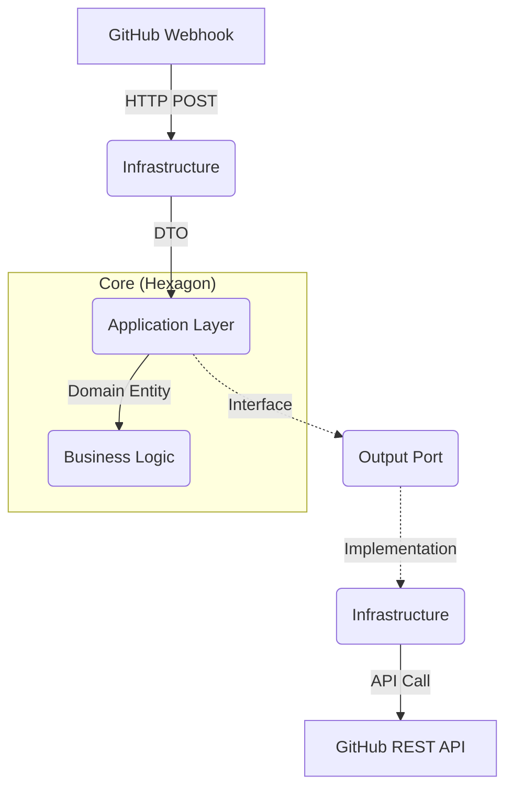

# AI-PR-Sentinel 🛡️

> **Automated Governance & Triage Bot for GitHub Repositories**
>
> *Master's Thesis Project (TFM) - Backend Architecture & AI Integration*


## 📋 Overview

**AI-PR-Sentinel** acts as an intelligent gatekeeper for software projects. It listens to GitHub events (Issues, PRs) and enforces governance policies automatically.

Unlike standard linters, this system understands **context** and **business rules**, applying "Governance as Code" principles to ensure repository hygiene before a human ever needs to intervene.

## 🏗️ Architecture

This project is built following **Strict Hexagonal Architecture (Ports & Adapters)** to ensure the business logic remains independent of frameworks and external tools.


## 🚀 Tech Stack
Runtime: Node.js v22 + pnpm Workspaces

Framework: Express (Minimalist Web Server)

Language: TypeScript (Strict Mode)

Testing: Jest + Supertest (TDD Approach)

Patterns: DDD, Hexagonal Architecture, Dependency Injection

## 🛠️ Project Structure
Bash
apps/api/src/
├── features/           # Vertical Slices (Screaming Architecture)
│   └── triage/
│       ├── domain/     # Pure Logic (Entities, Rules)
│       ├── application/# Use Cases & Ports
│       └── infrastructure/ # Controllers & Adapters
└── shared/             # Shared Kernel
## ⚡ Quick Start
### Prerequisites
- Node.js v22+

- pnpm (npm install -g pnpm)

## Installation
```Bash
# Clone repository
git clone [darkneiss/AI-PR-Sentinel](https://git@github.com:darkneiss/AI-PR-Sentinel.git)

# Change directory
cd AI-PR-Sentinel

# Node version
nvm use
# Install dependencies
pnpm install

# Run Tests (The Holy Grail)
pnpm test
```
## 🧪 Quality Assurance
This project follows strict TDD (Test Driven Development) protocols.

- Unit Tests: For Domain Logic (Fast, isolated).

- Integration Tests: For Controllers and Adapters.

Run the quality gate:

```Bash
pnpm quality
```
## 📜 Documentation
- [Governance Rules](./docs/specs/001-issue-governance.md)
- [Architecture Decisions (ADRs)](./docs/adr/ADR-001-llm-integration-strategy.md)
- [Setup Guide](./docs/SETUP_GUIDE.md)
- [Prompt Registry & Versioning](./docs/PROMPT_REGISTRY.md)

- [Agent Rules & Conventions](AGENTS.md)

- [Commit Template](./docs/COMMIT_TEMPLATE.md)
